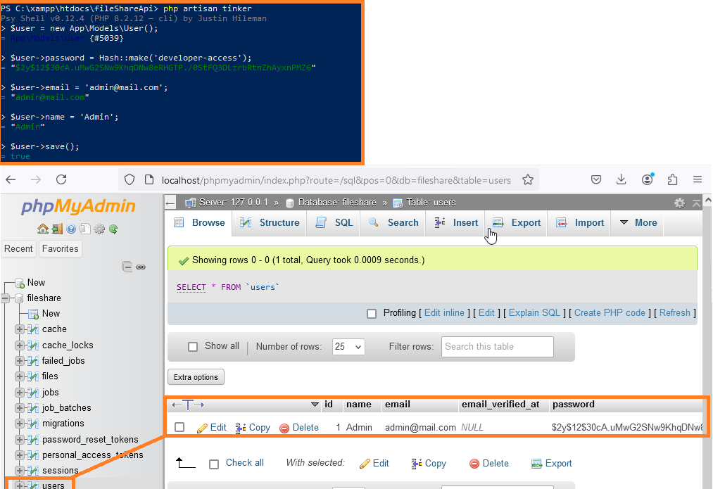
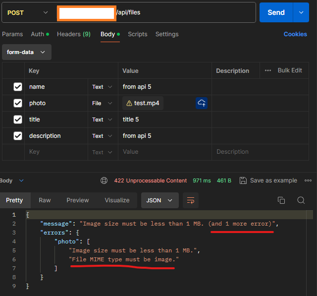
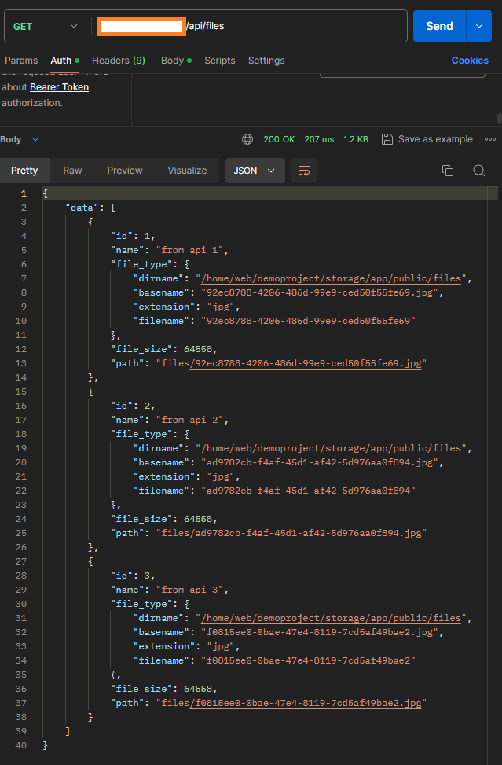
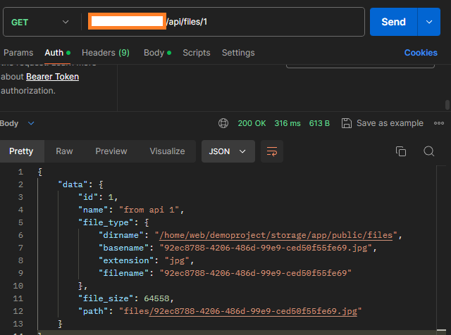

# fileShareApi Documentation

fileShareAPI helps us quickly store photos and retrieve data about them.

## Installing locally

### Setting up development tools

Before generating ssh keys, cloning and setting up our project locally, we must make sure we have the following tools installed - versions downloaded at this point of time are listed after links:

* XAMPP with PHP (8.2.12)

    We will use XAMPP as our web server with PHP version 8.2

    https://sourceforge.net/projects/xampp/files/XAMPP%20Windows/8.2.12/xampp-windows-x64-8.2.12-0-VS16-installer.exe/download

    After XAMPP installation we have to tweak php configuration file.
    Move to xampp/php folder and find php configuration file, then open it with text editor and find the following line:

    The folder should look like this:

    

    `;extension=zip` and remove the ';' then save the file.

    

*  Git - https://git-scm.com/download/win (v2.46)

* Composer - https://getcomposer.org/download/ (v2.7.7)
  
    __*Warning: Make sure XAMPP is installed before Composer, otherwise in Composer installation Wizard the PHP path will not be found!__

* NodeJS - https://nodejs.org/en/download/prebuilt-installer (v20.16.0 LTS)

* Postman - https://www.postman.com/downloads/ - Create account!

* Environment variables - make sure they are set up correctly:


### Generate ssh key

In terminal run the following command: `ssh-keygen -t ed25519 -C "your_github_mail@example.com"`

* Choose file where the key will be saved. Press Enter to choose recommended default path.
* Enter passphrase and save it, we will need it later!

If everything was done correctly, you should now have two keys in .ssh folder.


### Getting content of our public key

__* Warning: `cat` command might not work in normal terminal, but it will work on Powershell terminal!__

In terminal run the following command: `cat PATH/.ssh/id_ed25519.pub`

Copy the whole string starting from ssh-ed25519 to the end of your mail


### Add your public key to Github account

Log into your Github account and go to https://github.com/settings/keys

Click on button `New SSH key` then add title that refers to project and paste the content of public key and click 'Add SSH key'.


You should see your key now as such:


### Cloning the project locally 

Now we are ready to clone the project!

Open up your terminal and move into the folder `path/xampp/htdocs`.

In terminal run following command: `git clone git@github.com:lukaveck1/fileShareApi.git` and we should see the following:


### Composer

Move into the created folder with `cd fileShareApi` and now we need to run `composer install`. If we didn't enable the .zip extension in php configuration file, we might run into problems. So make sure it's enabled!


#### Configure .env file

Currently we only have .env.example file - the easiest way to set up your `.env` file is to simply rename `.env.example` file into `.env` file and from then on change it. It should now look like this:


### Set application encryption key

Run `php artisan key:generate` - we need to set a key before serving our files

### Create database and set .env file correctly

Run XAMPP and start Apache server and MySQL. 


Now go to folowing link `localhost/phpmyadmin` and create a new database. In our case we name it `fileshare` and then make sure you set the .env file accordingly:


Make sure the following variables are set identically!!!


```
DB_CONNECTION=mysql
DB_HOST=127.0.0.1
DB_PORT=3306
DB_DATABASE=fileshare
DB_USERNAME=root
DB_PASSWORD=
```

### Migrate database

Run `php artisan migrate` and we should see that our DB got updated.


### Serving our files

Now we can finally run `php artisan serve` and see our application up and running when we go to URL: `localhost:8000` -> make sure you specify port `:8000` after `localhost`!!!


### Adding token

To add a token, we must first create an user. To do so we can use `php artisan tinker` and specify user data then register new User.

```
php artisan tinker
$user = new App\Models\User();
$user->password = Hash::make('developer-access');
$user->email = 'admin@mail.com';
$user->name = 'Admin';
$user->save();
```



To add token now we need to run the following on our user:

`$user->createToken('developer-access');`

Save the plainTextToken value, since this is what we are going to use as our token when sending requests! We also got new record in database:


Now close tinker CLI by executing `exit();`.

### Sending requests with Postman

Now that we have our token we can finally use it to retrieve data or upload files.

Make sure that you have web server running in order for this step to work, so check again if you have executed `php artisan run` and have server running.

We can test with simple GET request to retrieve data and no authorization and then add token and do a GET/POST request to see if everything is working.

* Try GET request without token


* Try GET request with token


* Try POST request with token - we upload a file!


* Try GET request of all data again and check if file is in database


## Endpoints

| Method   | URL                                      | Description                              |
| -------- | ---------------------------------------- | ---------------------------------------- |
| `GET`    | `/api/files`                             | Retrieve all files.                      |
| `GET`    | `/api/files/{file}`                      | Retrieve data for desired file.          |
| `POST`   | `/api/files`                             | Save new file.                           |

## Payloads

`POST` | `/api/files`

| Query key  | Type     | Description                              | Extra comments                           |
| ---------- | -------- | ---------------------------------------- | ---------------------------------------- |
| `name`     | `String` | Name of file                             | Required                                 |
| `photo`    | `File`   | File content                             | Required                                 |
| `title`    | `String` | Title of the file                        | Required                                 |
| `description` | `String`   | Description of the file             | Required                                 |

## HTTP Response Status Codes

| Code  | Title                     | Description                              |
| ----- | ------------------------- | ---------------------------------------- |
| `200` | `OK`                      | Request successfully processed           |
| `201` | `Created`                 | Record has been added to the database    |
| `401` | `Unauthenticated`         | Token is not correct                     |
| `404` | `Not found`               | Record does not exist                    |
| `405` | `Method not allowed`      | Request to wrong endpoint                |
| `422` | `Unprocessable content`   | Request is missing specified parameters  |
| `429` | `Too many requests`   | Maximum number of requests in given time frame is reached  |

## Request limits

`GET` Requests are limited to 10 per minute.
`POST` Requests are limited to 5 per minute.

For more details check in the `Errors` section.

## Errors

When errors occur the consumer will get a JSON payload verifying that an error occurred together with a reason for why the error occurred.

### If token is not set when sending request:


```
{
    "message": "Unauthenticated."
}
```

### Missing required parameter in request


```
{
    "message": "The title field is required.",
    "errors": {
        "title": [
            "The title field is required."
        ]
    }
}
```

### Uploading file that is not image



```
{
    "message": "File MIME type must be image.",
    "errors": {
        "photo": [
            "File MIME type must be image."
        ]
    }
}
```

### Uploading image that is too big


```
{
    "message": "Image size must be less than 1 MB.",
    "errors": {
        "photo": [
            "Image size must be less than 1 MB."
        ]
    }
}
```

### Too many GET/POST requests 


```
{
    "error": "Number of GET requests per minute is limited to 10."
}
```


```
{
    "error": "Number of POST requests per minute is limited to 5."
}
```

## Examples of successful requests

### Successful post request


```
{
    "data": {
        "id": 4,
        "name": "from api 4",
        "file_type": {
            "dirname": "/home/web/demoproject/storage/app/public/files",
            "basename": "2b55e15e-13dc-4aaf-ab9d-00ad358a9422.jpg",
            "extension": "jpg",
            "filename": "2b55e15e-13dc-4aaf-ab9d-00ad358a9422"
        },
        "file_size": 64558,
        "path": "files/2b55e15e-13dc-4aaf-ab9d-00ad358a9422.jpg"
    }
}
```

### Collection of items



```
{
    "data": [
        {
            "id": 1,
            "name": "from api 1",
            "file_type": {
                "dirname": "/home/web/demoproject/storage/app/public/files",
                "basename": "92ec8788-4206-486d-99e9-ced50f55fe69.jpg",
                "extension": "jpg",
                "filename": "92ec8788-4206-486d-99e9-ced50f55fe69"
            },
            "file_size": 64558,
            "path": "files/92ec8788-4206-486d-99e9-ced50f55fe69.jpg"
        },
        {
            "id": 2,
            "name": "from api 2",
            "file_type": {
                "dirname": "/home/web/demoproject/storage/app/public/files",
                "basename": "ad9782cb-f4af-45d1-af42-5d976aa0f894.jpg",
                "extension": "jpg",
                "filename": "ad9782cb-f4af-45d1-af42-5d976aa0f894"
            },
            "file_size": 64558,
            "path": "files/ad9782cb-f4af-45d1-af42-5d976aa0f894.jpg"
        },
        {
            "id": 3,
            "name": "from api 3",
            "file_type": {
                "dirname": "/home/web/demoproject/storage/app/public/files",
                "basename": "f0815ee0-0bae-47e4-8119-7cd5af49bae2.jpg",
                "extension": "jpg",
                "filename": "f0815ee0-0bae-47e4-8119-7cd5af49bae2"
            },
            "file_size": 64558,
            "path": "files/f0815ee0-0bae-47e4-8119-7cd5af49bae2.jpg"
        }
    ]
}
```

### Item



```
{
    "data": {
        "id": 1,
        "name": "from api 1",
        "file_type": {
            "dirname": "/home/web/demoproject/storage/app/public/files",
            "basename": "92ec8788-4206-486d-99e9-ced50f55fe69.jpg",
            "extension": "jpg",
            "filename": "92ec8788-4206-486d-99e9-ced50f55fe69"
        },
        "file_size": 64558,
        "path": "files/92ec8788-4206-486d-99e9-ced50f55fe69.jpg"
    }
}
```