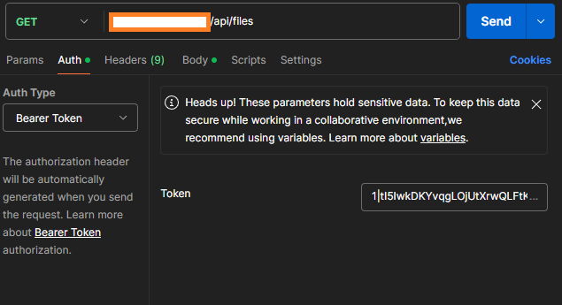
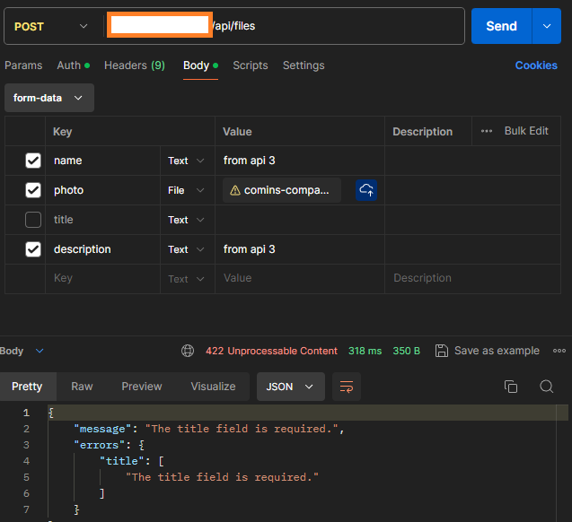
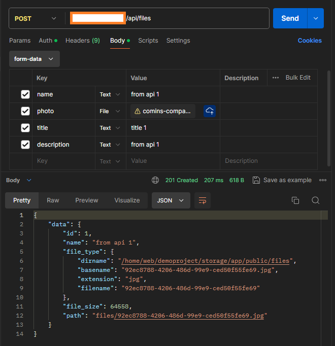

# fileShareApi Documentation

## Authorization

Token for authorization: 1|tI5IwkDKYvqgLOjUtXrwQLFtKaRCMgQuOFGhdsso7af921ac

### Setting token in Postman



## Endpoints

| Method   | URL                                      | Description                              |
| -------- | ---------------------------------------- | ---------------------------------------- |
| `GET`    | `/api/files`                             | Retrieve all files.                      |
| `GET`    | `/api/files/{file}`                      | Retrieve data for desired file.          |
| `POST`   | `/api/files`                             | Save new file.                           |

## Payloads

`POST` | `/api/files`

| Query key  | Type     | Description                              | Extra comments                           |
| ---------- | -------- | ---------------------------------------- | ---------------------------------------- |
| `name`     | `String` | Name of file                             | Required                                 |
| `photo`    | `File`   | File content                             | Required                                 |
| `title`    | `String` | Title of the file                        | Required                                 |
| `description` | `String`   | Description of the file             | Required                                 |

## HTTP Response Status Codes

| Code  | Title                     | Description                              |
| ----- | ------------------------- | ---------------------------------------- |
| `200` | `OK`                      | Request successfully processed           |
| `201` | `Created`                 | Record has been added to the database    |
| `401` | `Unauthenticated`         | Token is not correct                     |
| `404` | `Not found`               | Record does not exist                    |
| `405` | `Method not allowed`      | Request to wrong endpoint                |
| `422` | `Unprocessable content`   | Request is missing specified parameters  |


## Errors

When errors occur the consumer will get a JSON payload verifying that an error occurred together with a reason for why the error occurred.

### If token is not set when sending request:


```
{
    "message": "Unauthenticated."
}
```



### Missing required parameter in request

```
{
    "message": "The title field is required.",
    "errors": {
        "title": [
            "The title field is required."
        ]
    }
}
```

### Uploading file that is not image


```
{
    "error": "File MIME type must be image."
}
```

## Examples of successful requests

### Successful post request



```
{
    "data": {
        "id": 4,
        "name": "from api 4",
        "file_type": {
            "dirname": "/home/web/demoproject/storage/app/public/files",
            "basename": "2b55e15e-13dc-4aaf-ab9d-00ad358a9422.jpg",
            "extension": "jpg",
            "filename": "2b55e15e-13dc-4aaf-ab9d-00ad358a9422"
        },
        "file_size": 64558,
        "path": "files/2b55e15e-13dc-4aaf-ab9d-00ad358a9422.jpg"
    }
}
```

### Collection of items


```
{
    "data": [
        {
            "id": 1,
            "name": "from api 1",
            "file_type": {
                "dirname": "/home/web/demoproject/storage/app/public/files",
                "basename": "92ec8788-4206-486d-99e9-ced50f55fe69.jpg",
                "extension": "jpg",
                "filename": "92ec8788-4206-486d-99e9-ced50f55fe69"
            },
            "file_size": 64558,
            "path": "files/92ec8788-4206-486d-99e9-ced50f55fe69.jpg"
        },
        {
            "id": 2,
            "name": "from api 2",
            "file_type": {
                "dirname": "/home/web/demoproject/storage/app/public/files",
                "basename": "ad9782cb-f4af-45d1-af42-5d976aa0f894.jpg",
                "extension": "jpg",
                "filename": "ad9782cb-f4af-45d1-af42-5d976aa0f894"
            },
            "file_size": 64558,
            "path": "files/ad9782cb-f4af-45d1-af42-5d976aa0f894.jpg"
        },
        {
            "id": 3,
            "name": "from api 3",
            "file_type": {
                "dirname": "/home/web/demoproject/storage/app/public/files",
                "basename": "f0815ee0-0bae-47e4-8119-7cd5af49bae2.jpg",
                "extension": "jpg",
                "filename": "f0815ee0-0bae-47e4-8119-7cd5af49bae2"
            },
            "file_size": 64558,
            "path": "files/f0815ee0-0bae-47e4-8119-7cd5af49bae2.jpg"
        }
    ]
}
```

### Item


```
{
    "data": {
        "id": 1,
        "name": "from api 1",
        "file_type": {
            "dirname": "/home/web/demoproject/storage/app/public/files",
            "basename": "92ec8788-4206-486d-99e9-ced50f55fe69.jpg",
            "extension": "jpg",
            "filename": "92ec8788-4206-486d-99e9-ced50f55fe69"
        },
        "file_size": 64558,
        "path": "files/92ec8788-4206-486d-99e9-ced50f55fe69.jpg"
    }
}
```